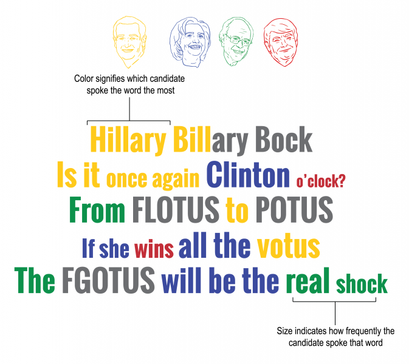

Campaign Limericks is project by Catherine D’Ignazio with the Institute for Infinitely Small Things. For this project, we stage parties to remix presidential candidates’ speeches into limericks. We call these “quantitative political poetry parties” or QPPPs.

At the QPPPs, we write limericks, talk politics, and share information. By remixing candidates’ top words and phrases on the campaign trail we produce limericks about politics, campaigning and the political process that were never spoken outright (but maybe should have been).

Anyone can stage a QPPP using our [kit](https://www.dropbox.com/scl/fo/0awu9q4may93ndcxppw6l/AL40mm_NPbVm1mA97xTxsLs?rlkey=3uwbun617ltxhp04idoil28ra&e=1&dl=0). We have had parties in Des Moines, Boston and Hartford. Mostly liberals have staged them and the left is currently winning the limerick war.

The best limericks have been realized as data visualizations in an exhibition space at the [Harvard Center for American Political Studies](https://caps.gov.harvard.edu/2016/03/31/campaign-limericks/). The color corresponds to the candidate who most frequently spoke that word or phrase. The size of the term is the relative frequency of that word related to other words spoken on the campaign trail. 

## Photo Slideshow



## More Information

[Campaign Limericks on exhibition at Harvard](https://caps.gov.harvard.edu/2016/03/31/campaign-limericks/)  
[Stage your own Campaign Limericks Party with our handy kit](https://www.dropbox.com/scl/fo/0awu9q4may93ndcxppw6l/AL40mm_NPbVm1mA97xTxsLs?rlkey=3uwbun617ltxhp04idoil28ra&e=1&dl=0)