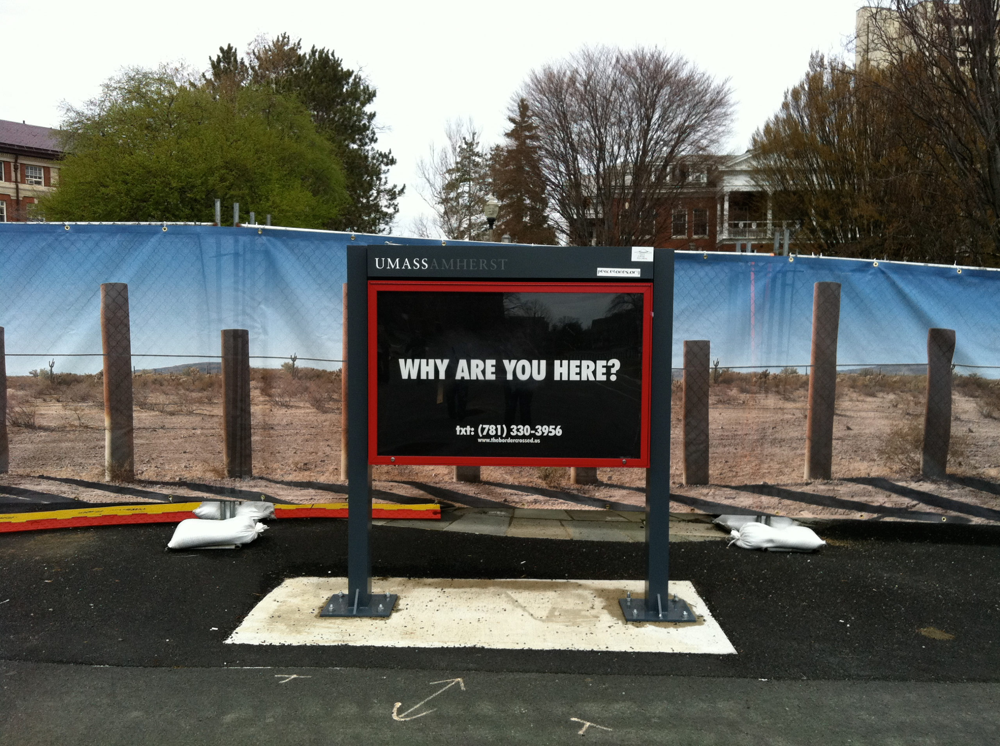
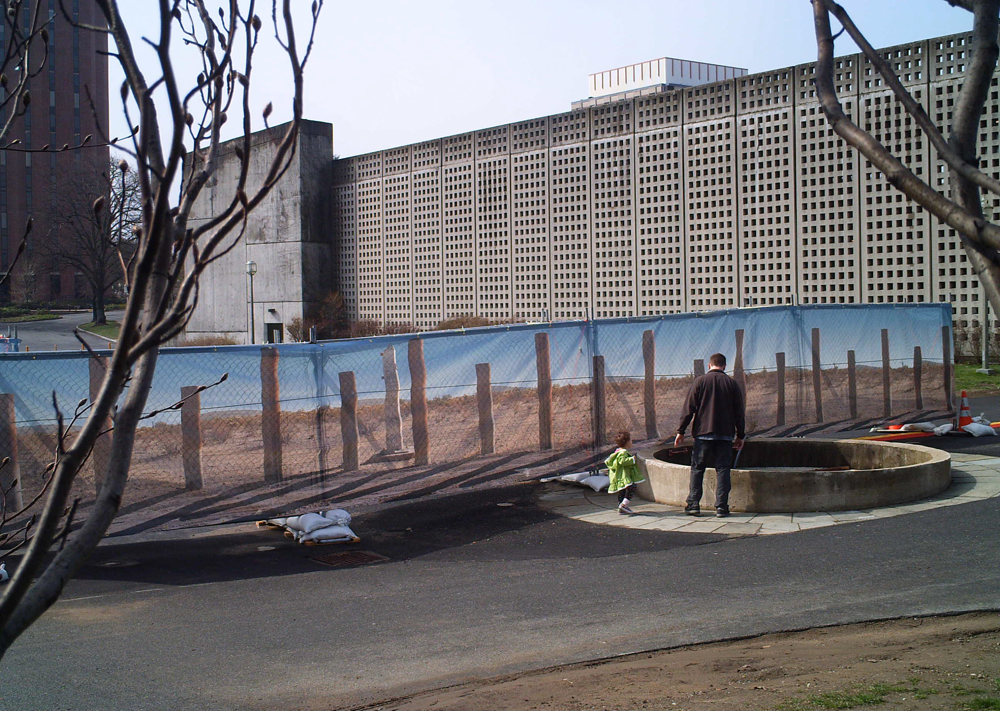

An invasive public art installation that brought the U.S.-Mexico border fence to the UMass Amherst campus, dividing its community into North and South. 

*In collaboration with The Institute for Infinitely Small Things and Ofelia Rivas.*

From April 20 to May 1, 2011, the University of Massachusetts Amherst campus was divided along its North-South boundary by a 1:1-scale photographic mural of the vehicle wall that defines the international border in southern Arizona. This particular stretch of wall represented divides the Tohono O’odham Nation—the second largest Native American reservation in the country—into two parts. It was erected in 2007 by Homeland Security.

<figure>
  
  <figcaption>An information board in front of the wall asked passersby “border questions” like: Are you a citizen? What color are you? Where are you going? Participants were able to text their responses to the project website.</figcaption>
</figure>

<figure>
  
  <figcaption>In front of the border, a large circular vent in the ground played the Eagle Song, a traditional song sung by Tohono O’odham elder Ofelia Rivas.</figcaption>
</figure>

How does the international border in Arizona touch all of our lives, despite it being seemingly far away from a college campus in New England? What happens when we divide a territory that the community imagines as contiguous? We may imagine that the border is far away in a remote desert, but if the border can cross the Tohono O’odham Nation, then the border can also cross us. This installation was produced in collaboration with Ofelia Rivas, a Tohono O’odham elder. A delegation of Tohono O’odham, including Rivas and several youth traveled to campus to speak about their experience. In addition, the Native American Studies Certificate Program in the Anthropology Department held a panel discussion on Borders & Indigenous Sovereignty as part of the campus’ annual Native American Powwow.

The fence ran between a parking garage and the campus center. Over the course of two weeks it served as a provocation, a touchstone for conversation, and a site for talks and performances. Along with the fence’s insertion into daily life on campus, the project invited a delegation of Tohono O’odham, including a tribal elder and several youth to speak about their experience. In addition, the Native American Studies Certificate Program in the Anthropology Department held a panel discussion on Borders & Indigenous Sovereignty as part of the campus’ annual Native American Powwow. Border issues affect several other tribes, including the Mohawk and Abenaki. The delegation of O’odham spoke along with others about these issues during the conference and participate in the powwow.



## Lead Artist

Catherine D’Ignazio

## Exhibitions

“The Border Crossed Us.” UMass Amherst. Commissioned public artwork. Amherst, MA. 2011.

## Publication

D’Ignazio, Catherine, Amber Day, and Nicole Siggins. “The Border Crossed Us (2011).” In Critical Landscapes: Art, Space, Politics, edited by Emily Eliza Scott and Kirsten Swenson, 142–46. Oakland, CA: University of California Press, 2015.

## Location

Amherst, MA

## Funder

University Museum of Contemporary Art at UMass Amherst

