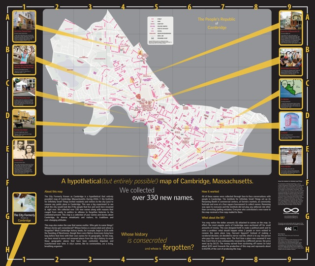
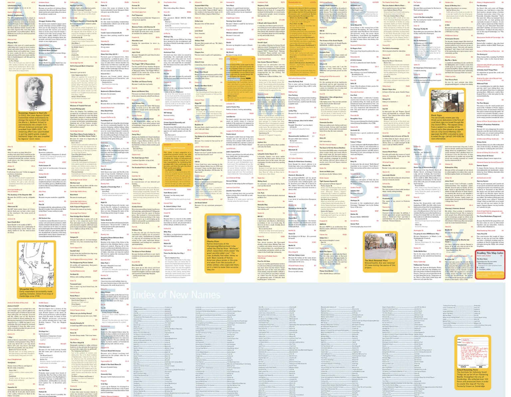

What would the city look like if we could all rename it today?

In a series of 13 renaming events between Spring 2006 – Summer 2007, the Institute for Infinitely Small Things collected over 300 new names for public spaces in Cambridge. The published map contains only the new names of Cambridge public spaces, along with the reasons why people renamed particular places.

Renaming reasons were various. A young man named several places after his friends because “they deserve it.” A five-year-old renamed Dana Park to Monkey Park because “I like monkeys.” People renamed neighborhoods to recall past histories (i.e. renaming Area 4 to Candyland to commemorate Necco and Squirrel candy companies). One woman renamed Harvard Street to Ann Radcliffe Street because, she said, Radcliffe gave all the money to found Harvard and never got any street out of it.

Finally, money was attached money to the renaming process. The first person to rename something got to do it for free. After that, the price went up by a quarter, a token amount of money to try to hint at the correlations between public memory and money.

<figure>
  
  <figcaption>The City Formerly Known as Cambridge is a map of public spaces renamed by the public.</figcaption>
</figure>

<figure>
  
  <figcaption>In 13 renaming events, we collected over 300 new names for public spaces in Cambridge. This directory lists all new names in alphabetical order.</figcaption>
</figure>

### Publications

 - D’Ignazio, Catherine. “Civic Imagination & a Useless Map.” In DIY Utopia: Cultural Imagination and the Remaking of the Possible, edited by Amber Day, 21–45. Lanham, Maryland: Lexington Books, 2017.

- D’Ignazio, Catherine. “The City Formerly Known as Cambridge: A Useless Map by the Institute for Infinitely Small Things.” In Geohumanities: Art, History, Text at the Edge of Place, edited by Michael J. Dear, Jim Ketchum, Sarah Luria, and Doug Richardson, 46–49. London: Routledge, 2011.

- Included in Harmon, Katharine A., and Gayle Clemans. The Map as Art: Contemporary Artists Explore Cartography. New York: Princeton Architectural Press, 2010.

### Media References

- “Funny Way to Pique Curiosity.” The Boston Globe, Nick Zaino, March 30, 2007.

- “A Street by Any Other Name: Group Tackles Monikers as Art.” The Boston Globe, Michael Kenney, August 6, 2006.

- “Down by the River.” The Boston Globe, Amy Roeder, June 15, 2006.

### Partner

Hedberg Maps

### Student Researchers

Senior Graphic Design class, Art Institute of Boston

### Location

Cambridge, MA

### Funder

LEF Foundation Contemporary Work Fund

